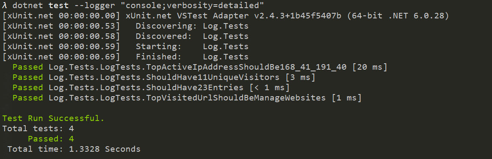
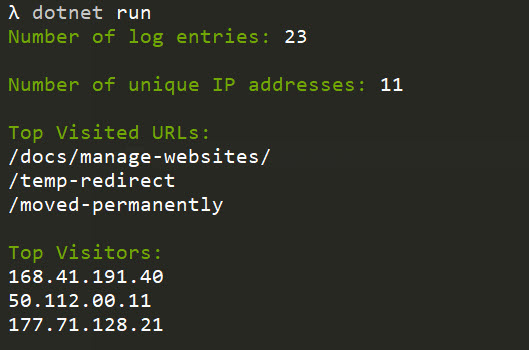

# Mantel Group Coding Test

The goal of this application is to read a log file and analyze its data based on the provided sample data.

# Log Sample

50.112.00.11 - admin [11/Jul/2018:17:33:01 +0200] "GET /asset.css HTTP/1.1" 200 3574 "-" "Mozilla/5.0 (Windows NT 6.1; WOW64) AppleWebKit/536.6 (KHTML, like Gecko) Chrome/20.0.1092.0 Safari/536.6"

# Assumptions

* The data will be broken down by white space while considering quotes and brackets as text qualifiers
* In the example above, here are my assumptions regarding each field:
  * IP Address: 50.112.00.11 
  * Unknown: - 
  * User (when available): admin 
  * Timestamp: [11/Jul/2018:17:33:01 +0200] 
  * Endpoint (method, URI, protocol): "GET /asset.css HTTP/1.1" 
  * HTTP Status code: 200 
  * Response Size (unsure): 3574 
  * Referrer (unsure): "-" 
  * User Agent: "Mozilla/5.0 (Windows NT 6.1; WOW64) AppleWebKit/536.6 (KHTML, like Gecko) Chrome/20.0.1092.0 Safari/536.6"
* When there are multiple URL with the same number of visits, the timestamp will be used for ranking
* When there are IP Addresses with the same number of visits, the timestamp will be used for ranking

# Testing

* in the console, navigate to the `Log.Tests` folder
* for a simple output, run `dotnet test`
* if you want to list all tests, you may run `dotnet test --logger "console;verbosity=detailed"`

# Running Cli

* in the console, navigate to the `Log.Cli` folder
* run `dotnet run`

